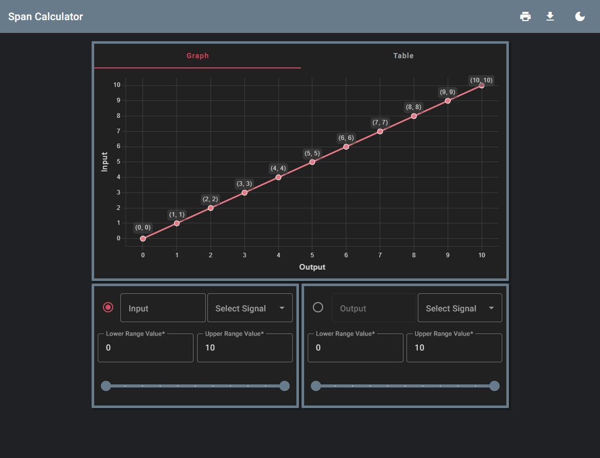
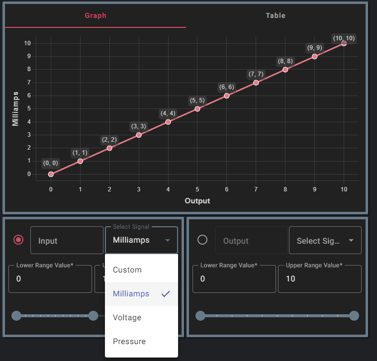
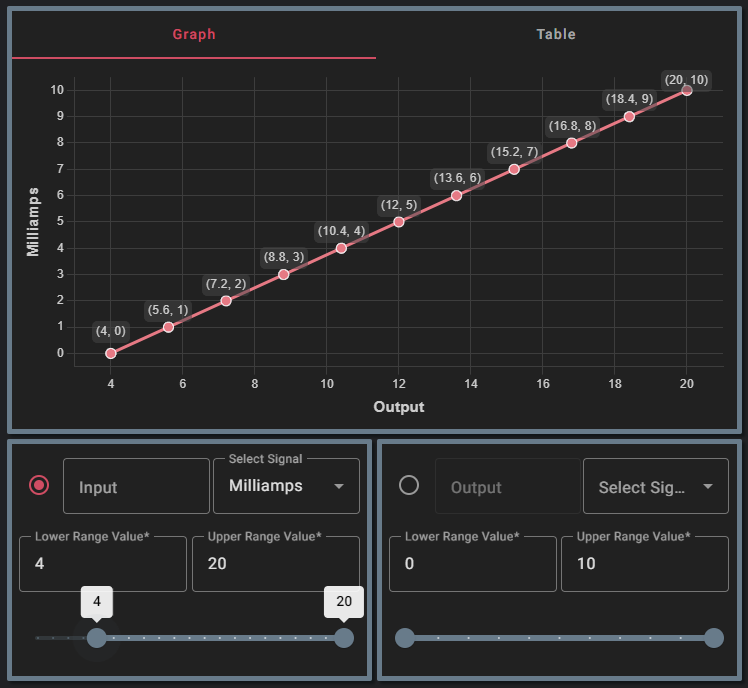
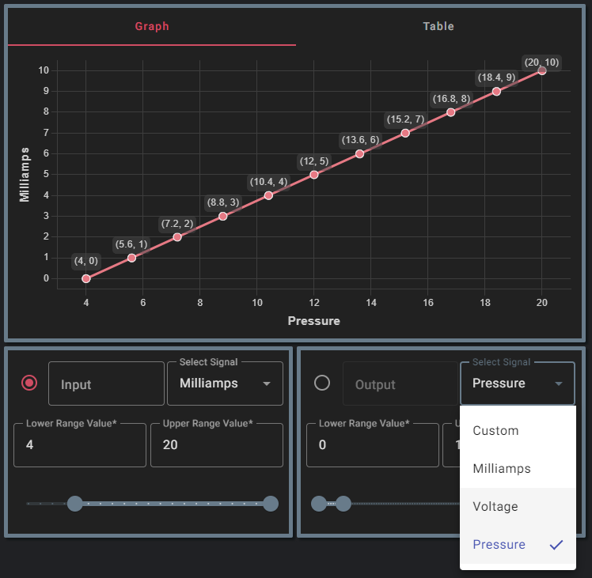
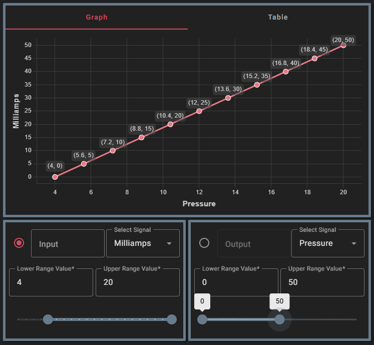

 
 Span Calculator

 <a href="Introduction">Introduction</a>

## Introduction 

`Span Calculator` is an interactive tool for calculating and visually representing the proportional/linear relationship between an input and output signal. When adjustments are made to the input or output upper or lower range values, the graph and table are updated accordingly. The application also allows for calculating a specific value's proportional response, by inputting the desired value into either the input or output boxes.

## Calculating Span

Uses the **slope intercept formula**:
$$y=mx + b$$

$$
\begin{gather*}
\frac{\text{Input}-LRV_{in}}{URV_{in}-LRV_{in}}=\frac{\text{Output}-LRV_{out}}{URV_{out}-LRV_{out}} = \text{per-unit ratio (x)}
\end{gather*}
$$
Solving for $\text{Input}$ and $\text{Output}$, we get two equations:
$$
\begin{gather*}
\text{Input}=(URV_{in}-LRV_{in})\cdot\text{x}+LRV_{in}\\
\text{or}\\
\text{Output}=(URV_{out}-LRV_{out})\cdot\text{x}+LRV_{out}
\end{gather*}
$$

- $URV_{in}$
  - The output range **high** feedback/response of the sensing device
- $LRV_{in}$
  - The output range **low** feedback/response of the sensing device

- $URV_{out}$
  - The unit output range **high** of the sensing device
- $LRV_{out}$
  - The unit output range **low** of the sensing device

### Example problems

1. **4-20mA** pressure sensor is giving us **8.5mA** back. If the pressure sensors range is **0-50psi**, what **pressure** is it reading?

 
 
 
 

- Starting with the $\text{Input}$ equation:

$$
\begin{gather*}
8.5 = (20-4) \cdot x + 4\\
4.5 = 16 \cdot x\\
x = 0.28125=\%28.13\\
\end{gather*}
$$

- Now that we have the per-unit percentage of milliamp signal we can now calculate the pressure

$$
\begin{gather*}
\text{Output} = (50-0) \cdot (0.28125) + 0\\
\text{Output} = 50 \cdot (0.28125)\\
\text{Output} = 14.1\text{psi}
\end{gather*}
$$

***

2. The sensor is now reading **32psi**. What should the milliamp reading be?

- Starting with the $\text{Output}$ equation:

$$
\begin{gather*}
32 = (50-0) \cdot x + (0)\\
32 = 50 \cdot x\\
x=0.64=64\%
\end{gather*}
$$

- Now calculate the current

$$
\begin{gather*}
\text{Input} = (20-4) \cdot (0.64)+ 4\\
\text{Input} = 14.24\text{mA}
\end{gather*}
$$

## Creating the Plot

Once we have calculated our primary signals slope intercept formula, the application uses **linear interpolation** to calculate a total of 10 points from

## Build

Run `ng build` to build the project. The build artifacts will be stored in the `dist/` directory.

## Running unit tests

Run `ng test` to execute the unit tests via [Karma](https://karma-runner.github.io).

## Running end-to-end tests

Run `ng e2e` to execute the end-to-end tests via a platform of your choice. To use this command, you need to first add a package that implements end-to-end testing capabilities.

## Further help

To get more help on the Angular CLI use `ng help` or go check out the [Angular CLI Overview and Command Reference](https://angular.io/cli) page.

[Introduction](#Introduction)