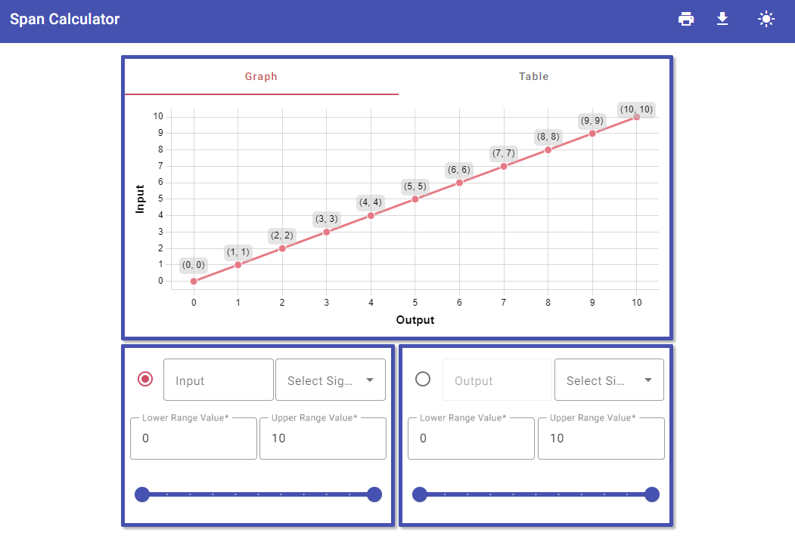

<h1>
  

    <picture align="center">
      <source srcset="./images/headerD.png" media="(prefers-color-scheme: dark)"/>
      
    </picture>
  

   
</h1>

 <a href="#introduction-">Introduction</a>&nbsp;&bull;&nbsp;
 <a href="#download-">Download</a>&nbsp;&bull;&nbsp;
 <a href="#usage-">Usage</a>&nbsp;&bull;&nbsp;
 <a href="#calculating-span-">Calculating Span</a>&nbsp;&bull;&nbsp;
 <a href="#credits-">Credits</a>

## Introduction 

`Span Calculator` is an interactive tool for calculating and visually representing the linear relationship between an input and output signal. The graph and table are updated accordingly when adjustments are made to the input or output upper or lower range values. The application also allows for calculating a specific value's proportional response, by inputting the desired value into either the input or output boxes.

 
  <picture>
    <source srcset="./images/applicationD.png" media="(prefers-color-scheme: dark)" width=60%/>
    
  </picture>

## Usage 

This section covers 2 example problems.  

1. A **4-20mA** pressure sensor is returning **8.5mA**. If the pressure sensor's range is **0-50psi**, what **pressure** is it reading?
    - Start by clicking the signal type drop-down to select the desired signal type.
    - Next, set up the input and output parameters by adjusting the range sliders or input boxes accordingly.
    - Finally, select the radio static button for the milliamp signal and input the given value (**8.5ma**). After you add the value to the input box a new point is created on the graph. The answer is the y coordinate: **14.06psi**.

  <picture align="center">
    <source srcset="./images/examples/ex1d.gif" media="(prefers-color-scheme: dark)" width=60%/>
    
  </picture>

> [!NOTE]
> In this example I have the input representing the range and feedback from the sensing device, and the output representing the range and measurement of the sensing device. Flipping these will cause no problems though.

> [!NOTE]
> If the `Signal Type` drop-down doesn't include the desired signal, you can select `Custom` which will give you a range from `[-100, 100]`

### Solving by hand

Starting with the <a href="#input">Input</a> equation:

$$
\begin{gather*}
8.5 = (20-4) \cdot x + 4\\
4.5 = 16 \cdot x\\
x = 0.28125\\
\end{gather*}
$$

Now that we have the per-unit percentage of the milliamp signal we can now calculate the pressure.

$$
\begin{gather*}
\text{Output} = (50-0) \cdot (0.28125) + 0\\
\text{Output} = 50 \cdot (0.28125)\\
\text{Output} = 14.1\text{psi}
\end{gather*}
$$

***

2. The sensor is now reading **32psi**. What should the milliamp reading be?
    - Sticking with the same parameters from the previous example, just select the output radio-static button and enter **32psi** in the numeric input box. The final answer should be **14.24mA**
  

  <picture align=center>
    <source srcset="./images/examples/ex2d.gif" media="(prefers-color-scheme: dark)" width=60%>
    
  </picture>

### Solving by hand

Starting with the <a href="#output">Output</a> equation:

$$
\begin{gather*}
32 = (50-0) \cdot x + (0)\\
32 = 50 \cdot x\\
x=0.64=64\%
\end{gather*}
$$

Now calculate the current:

$$
\begin{gather*}
\text{Input} = (20-4) \cdot (0.64)+ 4\\
\text{Input} = 14.24\text{mA}
\end{gather*}
$$

## Download 
You can [download](https://github.com/toddixon/span-calculator/releases/tag/v1.0.0) the latest version of Span Calculator for Windows.

## Calculating Span 

Uses the **slope intercept formula**:

$$y=mx + b$$

$$
\begin{gather*}
\frac{\text{Input}-LRV_{in}}{URV_{in}-LRV_{in}}=\frac{\text{Output}-LRV_{out}}{URV_{out}-LRV_{out}} = \text{per-unit ratio (x)}
\end{gather*}
$$

Solving for $\text{Input}$ and $\text{Output}$, we get two equations:

$$
\begin{gather*}
\text{Input}=(URV_{in}-LRV_{in})\cdot\text{x}+LRV_{in}
\end{gather*}
$$

$$
\text{or}\\
$$

$$
\begin{gather*}
\text{Output}=(URV_{out}-LRV_{out})\cdot\text{x}+LRV_{out}
\end{gather*}
$$

- $URV_{in}$
  - The output range **high** feedback/response of the sensing device
- $LRV_{in}$
  - The output range **low** feedback/response of the sensing device
- $URV_{out}$
  - The unit output range **high** of the sensing device
- $LRV_{out}$
  - The unit output range **low** of the sensing device

## Credits 
This software uses the following open-source packages:
- [Electron](https://www.electronjs.org/)
- [Angular](https://angular.io/)
- [node.js](https://nodejs.org/en)
- [Chart.js](https://www.chartjs.org/)
- [Angular Material](https://material.angular.io/)
